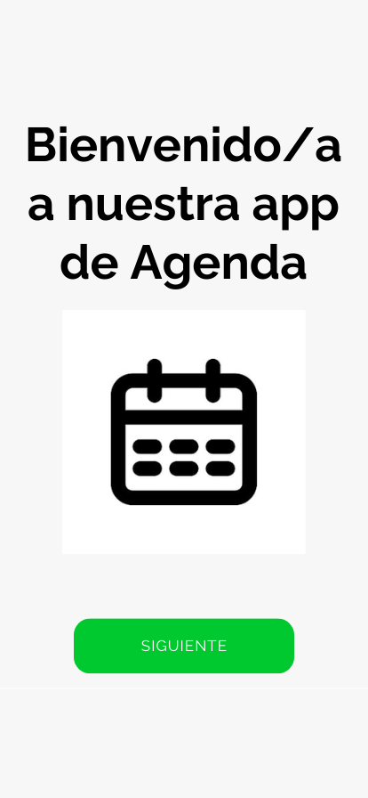
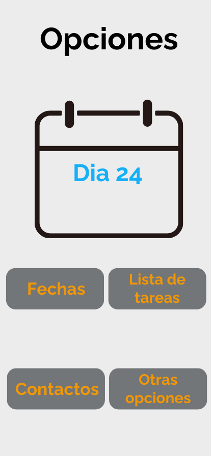
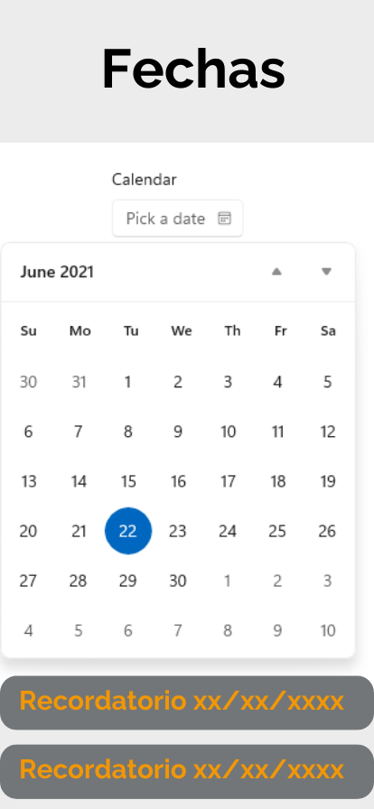
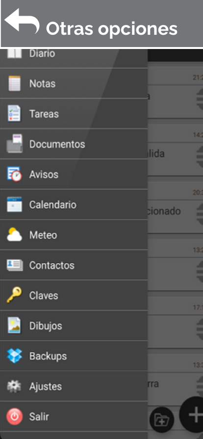
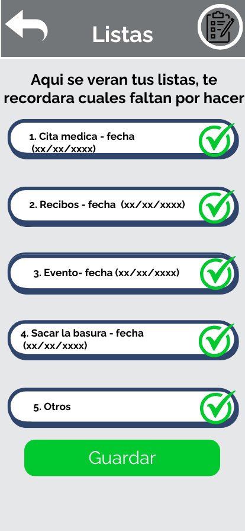
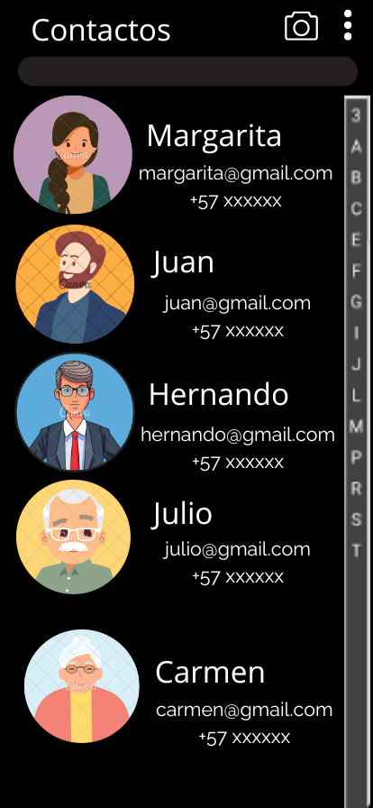

## Diseño de interfaz de usuario

La aplicación tendrá las siguientes pantallas y algunas siguen en construcción:

1. **Pantalla 1: Inicio**  
2. **Pantalla 2: Menú**  
3. **Pantalla 3: Fechas**  
4. **Pantalla 4: Otras opciones**  
5. **Pantalla 5: Listas**  
6. **Pantalla 6: Contactos**  

---

### Capturas de pantalla  

  
  
  
  
  

## Referencias
* [My Agenda](https://play.google.com/store/apps/details?id=com.tambucho.miagenda.trial&pcampaignid=web_share)  
